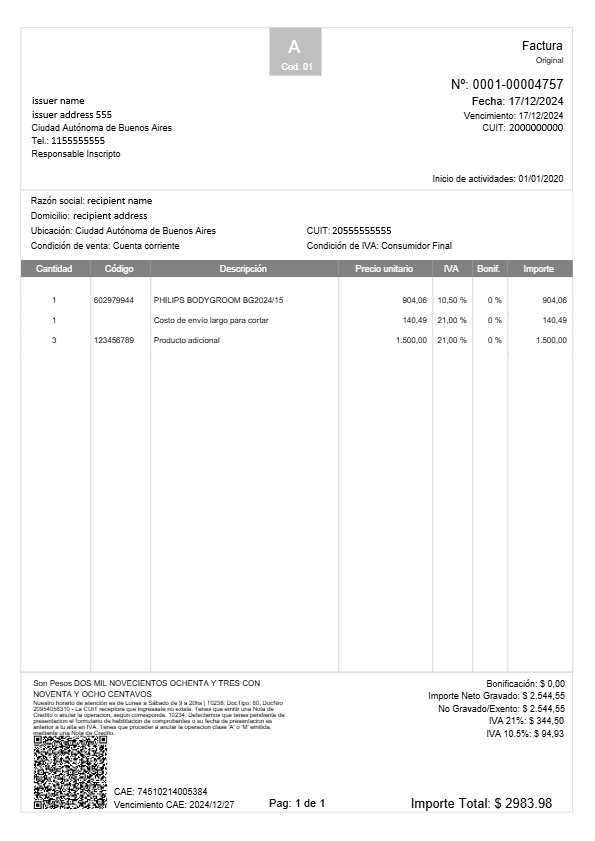

# Cómo emitir un comprobante

Esta guía te permitirá emitir un comprobante en la API, incluyendo los siguientes pasos:

* Creación del comprobante
* Consulta de estado
* Ejemplos de cada tipo de comprobante
* Impresión del comprobante

Para usar estos endpoints, es necesario incluir la **API Key** de tu empresa en cada petición.


Tu API Key se genera automáticamente al momento de crear tu empresa. **Guárdala en un lugar seguro**, ya que no podrás consultarla nuevamente.


***

### 1️⃣ **Emitir un Comprobante**

Envía una solicitud `POST` a la API con la información del comprobante.

#### 🔹 **Ejemplo de petición (cURL)**

**Estructura:**

```sh
curl --request POST '{{base_url}}/api/invoices' \
--header 'Content-Type: application/json' \
--header 'x-api-key: {{apiKey}}' \
--data-raw '{
  "issuer": { ... },
  "recipient": { ... },
  "items": [ ... ],
  "totals": { ... }
}'
```

<details>

<summary>Request POST invoice</summary>

```bash
curl --POST --location '{{base_url}}/api/invoices' \
--header 'Content-Type: application/json' \
--header 'x-api-key: {{apiKey}}' \
--data '{
  "branch_office": 1,
  "invoice_type": "FCA",
  "invoice_date": "2024-10-24 08:00:00",
  "payment_due_date": "2024-10-24",
  "service_start_date": "2024-10-24 00:00:00",
  "service_end_date": "2024-10-24 23:59:59",
  "concept": "3",
  "observations": "Nuestro horario de atención es de Lunes a Sábado de 9 a 20hs",
  "external_reference": "103513046",
  "issuer": {
    "legal_name": "issuer name",
    "document_type": "CUIT",
    "document_number": "20000000000",
    "address": {
      "country": "AR",
      "region": "AR-C",
      "address": "direccion issuer",
      "phone": "1155555555"
    }
  },
  "recipient": {
    "legal_name": "recipient name",
    "document_type": "CUIT",
    "document_number": "20555555555",
    "address": {
      "country": "AR",
      "region": "AR-C",
      "phone": "123456",
      "address" : "direccion recipient"
    }
  },
  "currency": {
    "code": "ARS",
    "exchange_rate": 1
  },
  "payment_method": {
    "code": "CON",
    "description": "Cuenta corriente"
  },
  "items": [
    {
      "quantity": 1,
      "code_unit_of_measure": "u",
      "discount_amount": 0,
      "unit_price": 95,
      "description": "A PRODUCTO",
      "code": {
        "type": "sku",
        "value": "898765"
      },
      "taxes": [
        {
            "type": "iva21",
            "amount": 19.95,
            "rate": 21
        }
      ]
    },
    {
      "quantity": 3,
      "code_unit_of_measure": "u",
      "unit_price": 100,
      "discount_amount": 10,
      "description": "prod b ",
      "taxes": [
        {
            "type": "iva105",
            "amount": 9.45,
            "rate": 10.50
        }
      ]
    },
    {
      "quantity": 1,
      "code_unit_of_measure": "u",
      "unit_price": 13000,
      "discount_amount": 0,
      "description": "1HSCONSUL",
      "code": {
        "type": "sku",
        "value": "1HSCONSUL"
      },
      "taxes": [
        {
            "type": "iva21",
            "amount": 2730,
            "rate": 21
        }
      ]
    }
  ],
  "totals": {
    "sub_total": 13395,
    "discount": 30,
    "taxes": [
      {
          "type": "iva21",
          "amount": 2749.95,
          "base_amount" : 13095
      },
      {
          "type": "iva105",
          "amount": 28.35,
          "base_amount" : 270.00
      }
    ],
    "total": 16143.30
  }
}'
```

</details>


Asegúrate de reemplazar `{{apiKey}}` con tu clave de API válida.


Este paso configura la información del comprobante, incluyendo:\
✔ Emisor y destinatario\
✔ Productos o servicios\
✔ Impuestos aplicables

***

### 2️⃣ **Consultar el Estado del Comprobante**

Después de emitir el comprobante, puedes consultar su estado ante el organismo fiscal y otros datos generados automáticamente.

#### 🔹 **Ejemplo de petición (cURL)**

```sh
--GET --location '{{base_url}}/api/invoices/{{invoice_id}}' \
--header 'Content-Type: application/json' \
--header 'x-api-key: {{apiKey}}' \
--header 'Accept: application/json'
```

📌 **Nota:** Reemplaza `{{invoice_id}}` con el identificador único del comprobante.

#### 🔹 **Ejemplo de respuesta**

```json
{
  "id": "123456",
  "number": "0001-00012345",
  "status": "Accepted",
  "electronic_authorization": {
    "type": "CAE",
    "code": "61123000000001",
    "expiration_date": "2024-12-31",
    "qr_url": "https://..."
  }
}
```

#### 🔹 **Explicación de los principales campos**

* **`id`** → Identificador único del comprobante.
* **`number`** → Número asignado al comprobante tras la emisión.
*   **`status`** → Estado actual del comprobante:

    | Estado       | Descripción                                      |
    | ------------ | ------------------------------------------------ |
    | `Pending`    | El comprobante está pendiente por ser procesado. |
    | `In process` | En espera de respuesta del ente fiscal.          |
    | `Accepted`   | Comprobante aceptado y emitido con éxito.        |
    | `Rejected`   | Comprobante rechazado (ver motivo).              |

<figure><figcaption><p>Flujo de estados de comprobantes</p></figcaption></figure>

* **`electronic_authorization`** → Datos de autorización electrónica (solo disponible si `status = Accepted`).

Con esta información, puedes verificar la validez del comprobante y gestionar procesos administrativos.

***

### 3️⃣ **Obtener el PDF del Comprobante**

Una vez que el comprobante tenga el estado `Accepted`, puedes descargar su versión en PDF (formato A4).

#### 🔹 **Ejemplo de petición (cURL)**

```sh
--location --request POST '{{base_url}}/api/invoices/{{invoice_id}}/download-pdf/A4' \
--header 'x-api-key: {{apiKey}}'
```

Respuesta:

<figure><figcaption></figcaption></figure>

📌 **Nota:** Para descargar en otros formatos, consulta la documentación de **Emisión e Impresión**.
